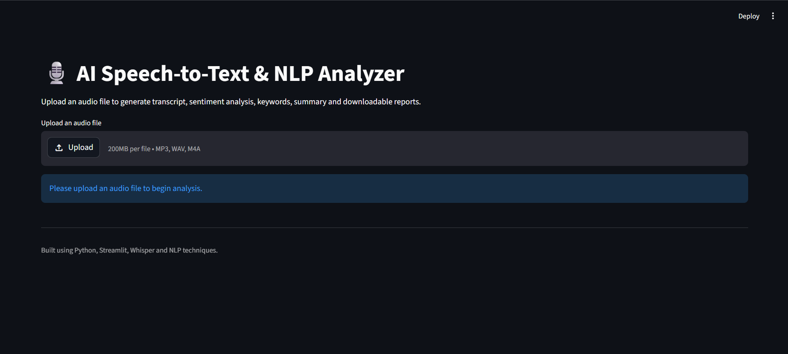
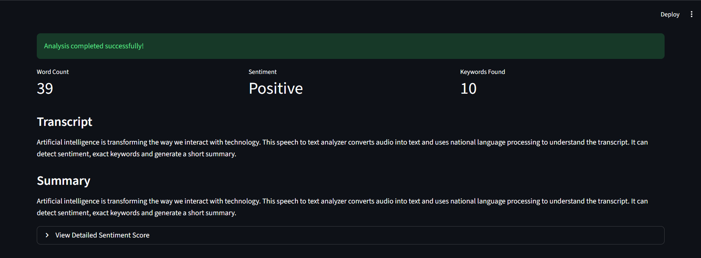
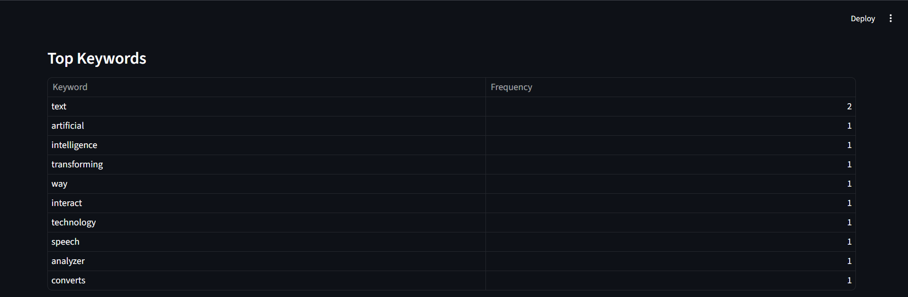

# 🎙️ AI Speech-to-Text & NLP Analyzer

An AI-powered web application that converts audio speech into text and performs Natural Language Processing (NLP) tasks such as sentiment analysis, keyword extraction, summary generation, and report downloading.

This project is built using **Python, Streamlit, OpenAI Whisper, and NLP techniques**.

---

## 🚀 Live Demo

🔗 **Deployed App:** https://speech-to-text-ai-analyzer-sahas.streamlit.app/

---

## 📌 Project Overview

The **AI Speech-to-Text & NLP Analyzer** allows users to upload an audio file and automatically convert the speech into text using an AI-based transcription model. After generating the transcript, the application analyzes the text to identify sentiment, extract important keywords, generate a short summary, and provide downloadable output files.

This project combines **Speech Recognition**, **Natural Language Processing**, and **Interactive Web App Development** into a single end-to-end application.

---

## ✨ Features

- 🎧 Upload audio files in MP3, WAV, or M4A format
- 📝 Convert speech into text using Whisper
- 📊 Display word count of the transcript
- 😊 Perform sentiment analysis on the transcript
- 🔑 Extract top keywords from the generated text
- 📄 Generate a short summary of the transcript
- 📥 Download transcript as a TXT file
- 📑 Download complete analysis report as a PDF
- 🌐 Interactive Streamlit-based user interface
- ☁️ Deployed on Streamlit Community Cloud

---

## 🛠️ Tech Stack

- **Python**
- **Streamlit**
- **OpenAI Whisper**
- **VADER Sentiment Analysis**
- **FPDF**
- **FFmpeg**
- **NLP Techniques**

---

## 📂 Project Structure

```text
Speech-to-Text-AI-Analyzer/
│
├── app.py
├── requirements.txt
├── packages.txt
├── README.md
├── .gitignore
│
├── src/
│   ├── transcriber.py
│   ├── sentiment_analyzer.py
│   ├── summarizer.py
│   ├── keyword_extractor.py
│   └── report_generator.py
│
├── sample_audio/
├── screenshots/
└── outputs/
```
## ⚙️ Installation & Setup
### 1. Clone the Repository
```bash
git clone https://github.com/YOUR_USERNAME/Speech-to-Text-AI-Analyzer.git 
cd Speech-to-Text-AI-Analyzer
```
### 2. Install Dependencies 
```bash 
pip install -r requirements.txt
```
### 3. Install FFmpeg FFmpeg is required for audio processing. 
#### Windows 
```bash 
winget install Gyan.FFmpeg
```
#### Linux / Streamlit Cloud 
FFmpeg is included through `packages.txt`: 
``` ffmpeg ``` 

### 4. Run the Application 
```bash 
streamlit run app.py
```
--- 
## 🧠 How It Works 
1. The user uploads an audio file.
2. The audio file is processed using Whisper.
3. Whisper converts speech into text. 
4. The generated transcript is analyzed using NLP techniques. 
5. Sentiment score is calculated using VADER Sentiment Analysis. 
6. Important keywords are extracted from the transcript. 
7. A short summary is generated. 
8. The user can download both the transcript and PDF report. 
--- 
## 📸 Screenshots 
### Upload Screen 
 

### Analysis Result 
 

### Keyword & Report Section 
 

--- 
## 📊 Output 
The application generates: 
- Transcript text 
- Word count 
- Sentiment result 
- Detailed sentiment score 
- Top keywords 
- Summary 
- Downloadable TXT transcript 
- Downloadable PDF report 
--- 

## 📄 Sample Output 
```text 
Transcript: Artificial intelligence is transforming the way we interact with technology. This speech-to-text analyzer converts audio into text and uses natural language processing to understand the transcript. 
Sentiment: Positive 
Top Keywords: artificial, intelligence, technology, speech, analyzer 
``` 
--- 

## 📦 Deployment 
This project is deployed using **Streamlit Community Cloud**. 
For deployment, the following files are important: 
```text 
requirements.txt 
packages.txt 
app.py 
src/ 
``` 
`packages.txt` includes: 
```txt
ffmpeg
``` 
This ensures that FFmpeg is available in the Streamlit Cloud environment. 
--- 

## 🔮 Future Enhancements 
- Add support for multiple languages 
- Improve summary generation using advanced NLP models 
- Add speaker identification 
- Add real-time microphone recording 
- Export report in DOCX format 
- Add audio duration and confidence score 
- Improve keyword extraction using TF-IDF 
--- 

## 📚 Learning Outcomes 
Through this project, I learned: 
- How to build an AI-powered Streamlit web application 
- How speech-to-text transcription works using Whisper 
- How to perform sentiment analysis on generated text 
- How to extract keywords from text data 
- How to generate downloadable TXT and PDF reports 
- How to deploy a Python application on Streamlit Cloud 
- How to handle external dependencies like FFmpeg 
--- 

## 👨‍💻 Author 
**Sahas Bochare** 
- GitHub: https://github.com/Sahas-2417 
- LinkedIn: https://www.linkedin.com/in/sahasbochare/ 
---

## ⭐ Acknowledgement 
---
This project uses open-source Python libraries and AI/NLP tools to demonstrate how audio data can be converted into meaningful text-based insights. 
--- 

## 📌 Project Status 
✅ Completed and deployed successfully. 

